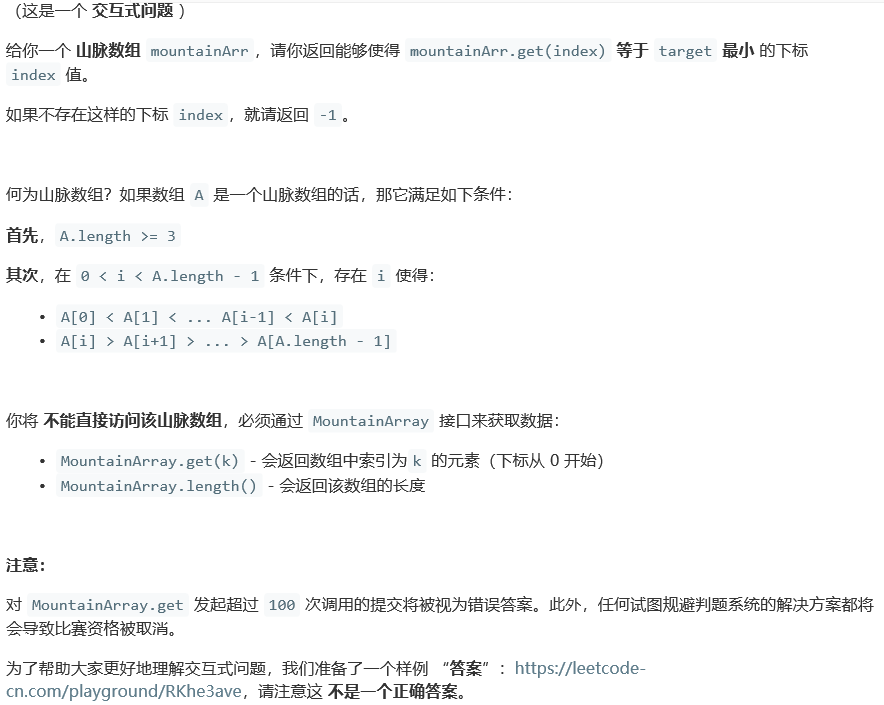
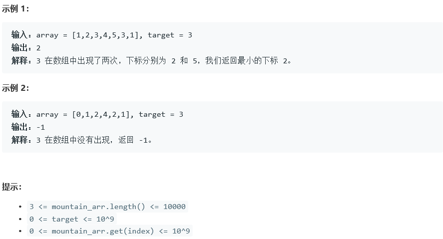
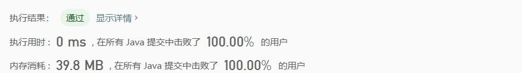

# 1095. 山脉数组中查找目标值

## Description





## Tag

- 二分查找

## Solution

> 二分查找出最高点；（通过判断下标为mid和mid+1的数值升序或是降序）
>
> 一次升序二分查找，一次逆序二分查找；

## Code

```java
/**
 * // This is MountainArray's API interface.
 * // You should not implement it, or speculate about its implementation
 * interface MountainArray {
 *     public int get(int index) {}
 *     public int length() {}
 * }
 */
 
class Solution {
    public int findInMountainArray(int target, MountainArray mountainArr) {
        int n = mountainArr.length();
        int low = 0, high = n - 1;
        while(low < high) {
            int mid = (high - low) / 2 + low;
            int midValue = mountainArr.get(mid);
            int nextValue = mountainArr.get(mid + 1);
            if(midValue < nextValue) {
                low = mid + 1;
            } else{
                high = mid;
            }
        }
        int maxIndex = low;
        low = 0; high = maxIndex;
        while(low <= high) {
            int mid = (high - low) / 2 + low;
            int midValue = mountainArr.get(mid);
            if(midValue == target) {
                return mid;
            } else if(midValue < target){
                low = mid + 1;
            } else {
                high = mid - 1;
            }
        }
        low = maxIndex + 1; high = n - 1;
        while(low <= high) {
            int mid = (high - low) / 2 + low;
            int midValue = mountainArr.get(mid);
            if(midValue == target) {
                return mid;
            } else if(midValue > target){
                low = mid + 1;
            } else {
                high = mid - 1;
            }
        }
        return -1;
    }
}
```

## Record



