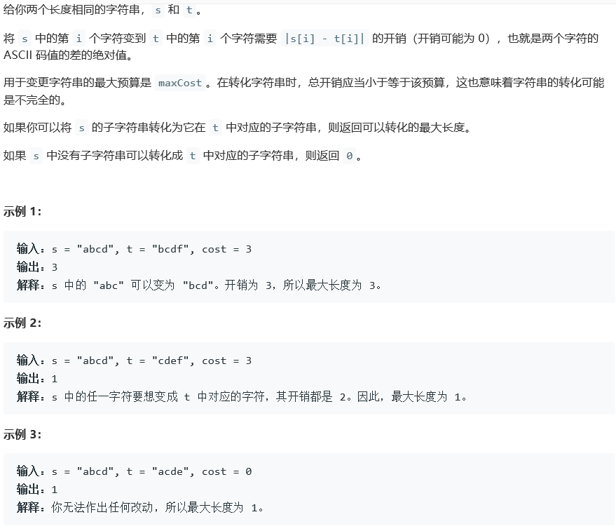
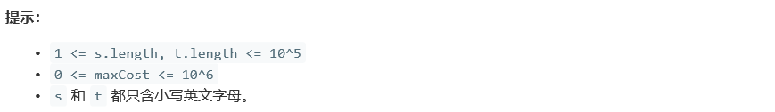
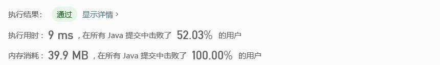

## 1208. 尽可能使字符串相等

## Description





## Tag

- 滑动窗口；

## Solution

> 双指针记录首尾，滑动窗口。

## Code

```java
class Solution {
    public int equalSubstring(String s, String t, int maxCost) {
        int totCost = 0, result = 0;
        int n = s.length();
        for(int start = 0, end = 0; end < n; end++) {
            int nextCost = Math.abs(s.charAt(end) - t.charAt(end));
            totCost += nextCost;
            if(totCost <= maxCost) {
                result = Math.max(end - start + 1, result);
            } else {
                totCost -= Math.abs(s.charAt(start) - t.charAt(start));
                start++;
            }
        }
        return result;
    }
}
```

## Record



