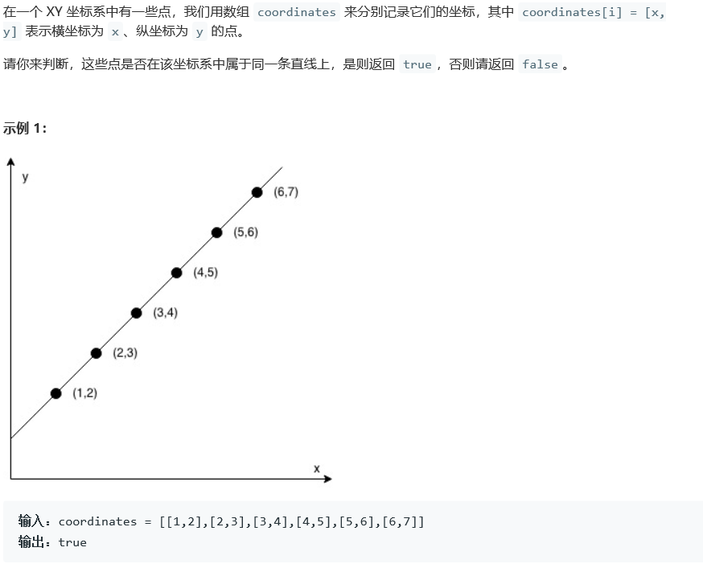

## 1232. 缀点成线

## Description




## Tag

- 数学；

## Solution

> 求前两点斜率，对分母为0的情况赋值无穷大；
> 计算后几个点与第二个点的斜率，若不相等，则为false

## Code

```java
class Solution {
    public boolean checkStraightLine(int[][] coordinates) {

        double k = Double.MAX_VALUE;
        if((coordinates[0][0] - coordinates[1][0]) != 0)
            k = (coordinates[0][1] - coordinates[1][1]) / (coordinates[0][0] - coordinates[1][0]);
        for(int i = 2; i < coordinates.length; i++) {
            double k1 = Double.MAX_VALUE;
            if((coordinates[i][0] - coordinates[1][0]) != 0)
                k1 = (coordinates[i][1] - coordinates[1][1]) / (coordinates[i][0] - coordinates[1][0]);
            if(Math.abs(k1 - k) >= 1e-6)
                return false;
        }
        return true;
    }
}
```

## Record


