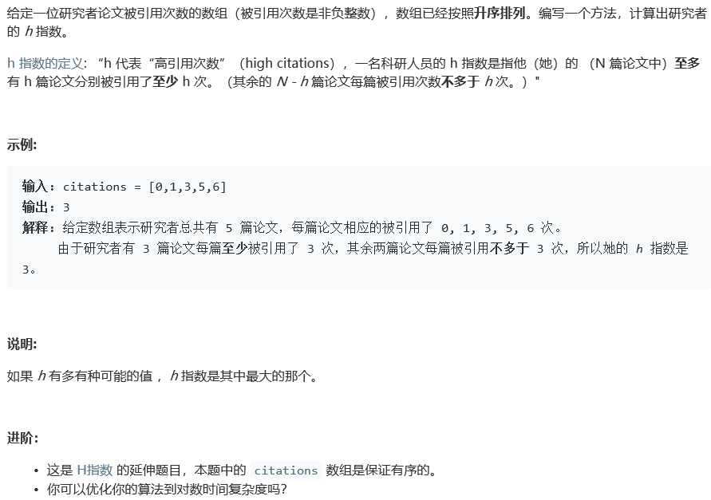

# 275. H指数 II

## Description



## Tag

- 二分查找；

## Solution

> 通过长度和引用次数的比较进行二分查找

## Code

```java
class Solution {
    public int hIndex(int[] citations) {
        if(citations.length == 0)
            return 0;
        int lowerBound = 0, upperBound = citations.length - 1;
        while(lowerBound < upperBound) {
            int mid = (lowerBound + upperBound) / 2;
            if(citations[mid] < (citations.length - mid)) {
                upperBound = mid - 1;
            } else if(citations[mid] > (citations.length - mid)){
                lowerBound = mid + 1;
            } else {
                return (citations.length - mid);
            }
        }
        return lowerBound + 1;
    }

}
```

## Record


