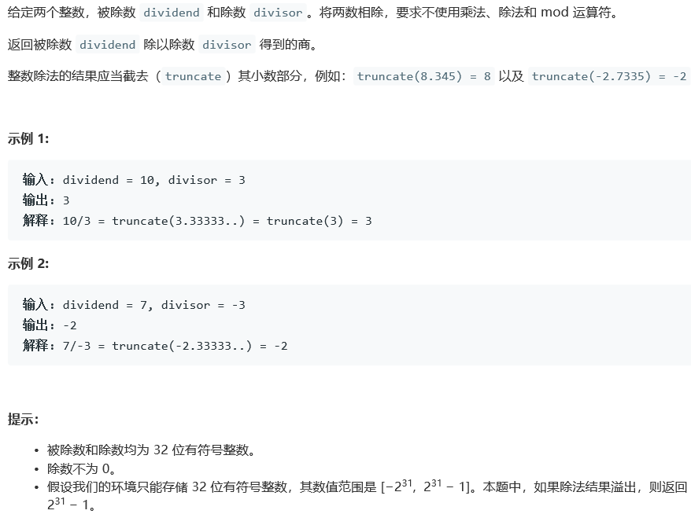
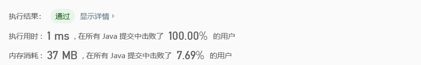

# 29. 两数相除

## Description



## Tag

- 除法运算

## Solution

> 模拟除法器硬件

## Code

```java
class Solution {
    public int divide(int dividend, int divisor) {
        if(divisor == 1)
            return dividend;
        else if(divisor == -1)
            if(dividend == Integer.MIN_VALUE)
                return Integer.MAX_VALUE;
            else 
                return -dividend;
        
        int left = 0;
        boolean signDividend = dividend < 0;
        boolean signDivisor = divisor < 0;
        long remainder = dividend;
        long quotient = 0;
        long mDivisor = divisor;
        remainder = Math.abs(remainder);
        mDivisor = Math.abs(mDivisor);

        while((mDivisor << left) >= 0)
            left++;
        left--;
        mDivisor <<= left;
        for(int i = 0; i <= left; i++) {
            remainder = remainder - mDivisor;
            if(remainder >= 0) {
                quotient = (quotient << 1) + 1;
            } else {
                remainder += mDivisor;
                quotient <<= 1;
            }
            mDivisor >>= 1;
        }
        if(signDividend ^ signDivisor)
            quotient = -quotient;
        return (int)quotient;
    }
}
```

## Record



