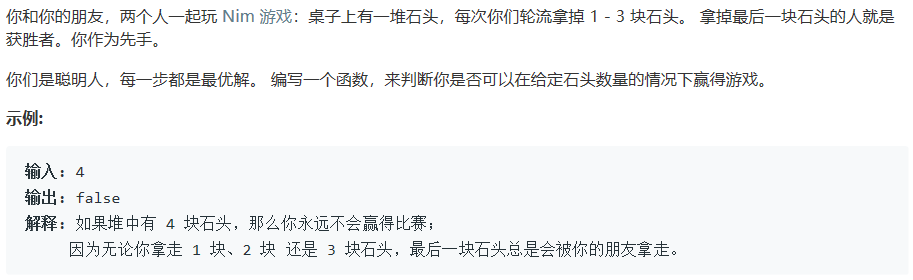

# 292. Nim 游戏

## Description



## Tag

- 递推；

## Solution

> 题干说每一步都是最优解，因此题目转换成计算必赢的情况；
>
> 由题意可得，当最后一人时只有1/2/3颗石头时必赢；
>
> 当我方只有4颗石头时，无论选择1/2/3颗石头，都会给对面剩下1/2/3颗石头，对方必赢，因此要赢必然要给对方凑出4颗石头；
>
> 当我方有5-7颗石头时，都可以给对方凑出4颗石头，因此我方必赢；
>
> 当我方有8颗石头时，无论选择1/2/3颗石头，对方必然能够给我方凑出4颗石头，我方必输；

> 以此类推，由于我方先手，
>
> 开始时为4k颗石头，我方必输；
>
> 我方非4k颗石头时，由于每一步都是最优解，我方必然可以给对方凑出4k颗石头，我方必赢。

## Code

```java
class Solution {
    public boolean canWinNim(int n) {
        return n % 4 != 0;
    }
}
```

## Record


