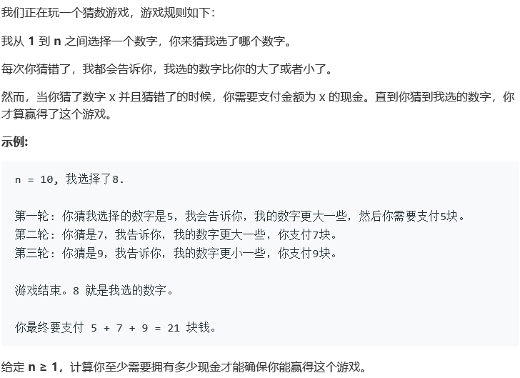

## 375. 猜数字大小 II

## Description



## Tag

- 动态规划；

## Solution

$$
Cost[i][j] = min(k + max(Cost[i][k-1] + Cost[k+1][j]))(遍历i-j获取k)
$$

## Code

```java
public class Solution {
    public int getMoneyAmount(int n) {
        int[][] dp = new int[n + 1][n + 1];
        for (int len = 2; len <= n; len++) {
            for (int start = 1; start <= n - len + 1; start++) {
                int minres = Integer.MAX_VALUE;
                for (int piv = start; piv < start + len - 1; piv++) {
                    int res = piv + Math.max(dp[start][piv - 1], dp[piv + 1][start + len - 1]);
                    minres = Math.min(res, minres);
                }
                dp[start][start + len - 1] = minres;
            }
        }
        return dp[1][n];
    }
}
```

## Record


