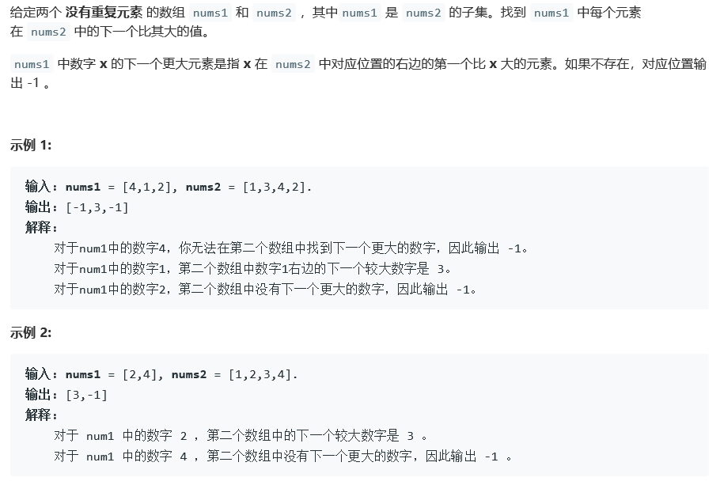
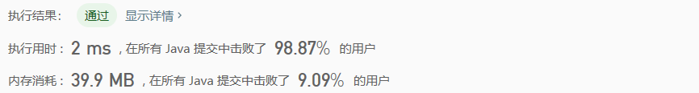
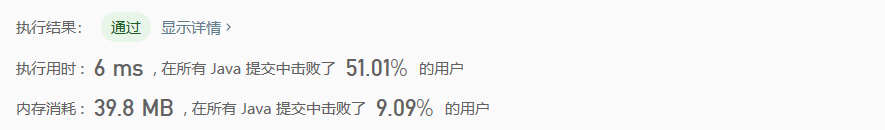

# 496. 下一个更大元素 I

## Description



## Tag

- 哈希表；
- 单调栈；

## Solution

> Solution 1：
>
> 用哈希表倒置nums2，即数值对应下标；


> Solution 2：
>
> 用栈记录nums2的元素A，当数组的后续出现更大的元素B时，出栈比B小的所有元素，并将（A，B）的对应关系记录到哈希表中；


## Code

```java
// Solution 1
class Solution {
    public int[] nextGreaterElement(int[] nums1, int[] nums2) {
        Map<Integer, Integer> map = new HashMap<Integer, Integer>();
        int result[] = new int[nums1.length];
        Arrays.fill(result, -1);
        for(int i = 0; i < nums2.length; i++)
            map.put(nums2[i], i);
        for(int i = 0; i < nums1.length; i++) {
            int index = map.get(nums1[i]);
            for(int j = index + 1; j < nums2.length; j++) {
                if(nums2[j] > nums1[i]){
                    result[i] = nums2[j];
                    break;
                }
            }
        }
        return result;
    }
}
// Solution 2
class Solution {
    public int[] nextGreaterElement(int[] nums1, int[] nums2) {
        Map<Integer, Integer> map = new HashMap<Integer, Integer>();
        Stack<Integer> stack = new Stack<Integer>();
        int result[] = new int[nums1.length];
        for(int i = 0; i < nums2.length; i++) {
            while(!stack.empty() && stack.peek() < nums2[i]) {
                map.put(stack.pop(), nums2[i]);
            }
            stack.push(nums2[i]);
        }
        for(int i = 0; i < nums1.length; i++) {
            result[i] = map.getOrDefault(nums1[i], -1);
        }
        return result;
    }
}
```

## Record



