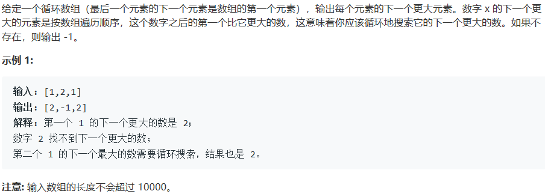
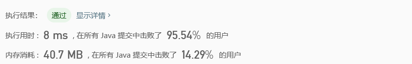

# 503. 下一个更大元素 II

## Description



## Tag

- 单调栈；

## Solution

> 用数组记录每一个下标的下一个更大的数；

> 由于要输出的是每一个下标的下一个更大的数，因此用单调栈记录数组中的递减部分，当出现大于栈顶的数时，循环出栈，在数组中记录值。

## Code

```java
class Solution {
    public int[] nextGreaterElements(int[] nums) {
        Stack<Integer> stack = new Stack<Integer>();
        int result[] = new int[nums.length];
        Arrays.fill(result, -1);
        for(int i = 0; i < nums.length; i++) {
            while(!stack.empty() && nums[stack.peek()] < nums[i])
                result[stack.pop()] = nums[i];
            stack.push(i);
        }
        for(int i = 0; i < nums.length; i++) {
            if(stack.empty())
                break;
            while(!stack.empty() && nums[stack.peek()] < nums[i])
                result[stack.pop()] = nums[i];
        }
        return result;
    }
}
```

## Record



