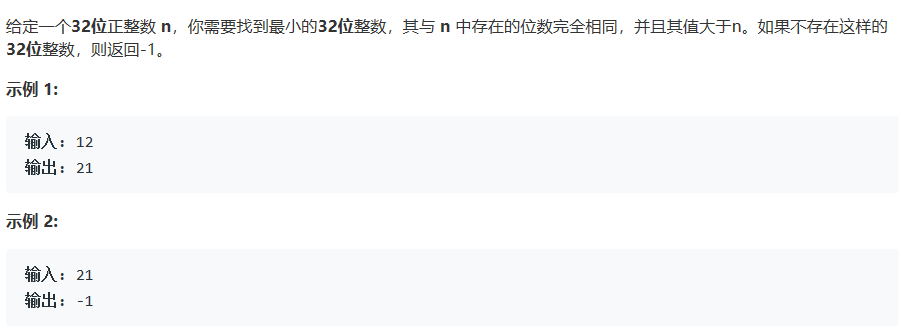
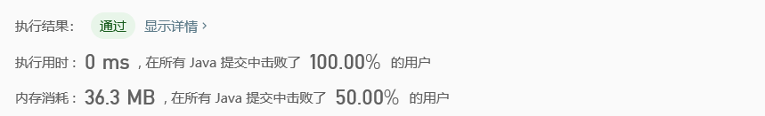

# 556. 下一个更大元素 III

## Description



## Tag

- 字符串；

## Solution

> 当最右边的位的数值降序时，不存在更大的数，因此最小的更大的数必然是在最右边满足a[i] < a[i+1]的第i位与右边降序元素的的交换；

> 由于要最小的更大的数，因此从右边降序元素中取大于第i位的最小的数与第i位进行交换；

> 交换完成后，可能导致右侧不再满足降序，因此对第i位右侧的元素进行排序。

## Code

```java
class Solution {
    public int nextGreaterElement(int n) {
        char str[] = new Integer(n).toString().toCharArray();
        int index = 0;
        for(int i = str.length - 2; i >= 0; i--) {
            if(str[i] < str[i + 1]){
                index = i;
                break;
            }
        }
        int min = 0;
        for(int i = index + 1; i < str.length; i++)
            if(str[i] > str[index] && (min == 0 || str[i] < str[min]))
                min = i;
        if(min != 0) {
            str[index] = (char) (str[index] ^ str[min]);
            str[min] = (char) (str[index] ^ str[min]);
            str[index] = (char) (str[index] ^ str[min]);
            Arrays.sort(str, index + 1, str.length);
            try {
                return Integer.parseInt(String.valueOf(str));
            } catch (NumberFormatException e) {}
        }
        return -1;
    }
}
```

## Record

