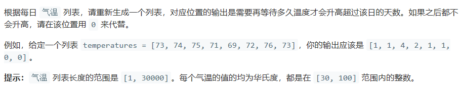
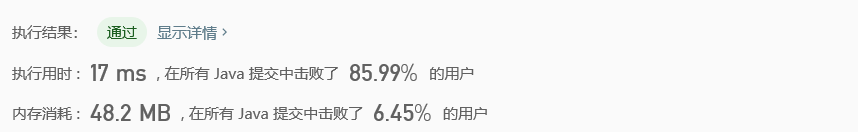

# 739. 每日温度

## Description



## Tag

- 逆序；

## Solution

> arr[i]记录距离当前下标位置最近的温度为i的位置的下标；

> 由于前面的状态只受到后面的状态的影响，因此逆序对数组进行操作；

## Code

```java
class Solution {
    public int[] dailyTemperatures(int[] T) {
        int arr[] = new int[102];
        int result[] = new int[T.length];
        for(int i = T.length - 2; i >= 0; i--) {
            arr[T[i+1]] = i+1;
            int min = T[i]+1;
            for(int j = T[i]+2; j <= 100; j++)
                if(arr[j] != 0 && (arr[min] == 0 || arr[min] > arr[j]))
                    min = j;
            if(arr[min] != 0)
                result[i] = arr[min] - i;
            else
                result[i] = 0;
        }
        return result;
    }
}
```

## Record



