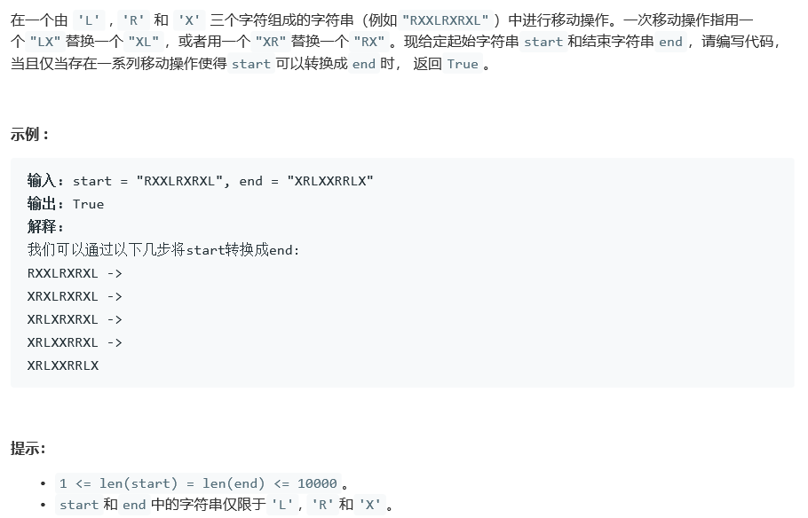

# 777. 在LR字符串中交换相邻字符

## Description



## Tag

- 性质分析，取巧；

## Solution

> 移动规则：XL->LX，RX->XR；
>
> X理解成空白格，L和R的移动等价成L可以左移，R可以右移；

> 性质1：
>
> L只能左移，因此start中的L必然在end中的L的右侧或不变；
>
> R只能右移，因此start中的L必然在end中的R的左侧或不变；

> 性质2：
>
> L要发生左移，左侧必然为X，若左侧为R，则L无法继续左移，因此L和R的顺序不可能发生变化；

## Code

```java
class Solution {
    public boolean canTransform(String start, String end) {
        int length = start.length();
        int cntL = 0, cntR = 0;
        for(int i = 0; i < length; i++){
            if(start.charAt(i) == 'R')      cntR++;
            if(end.charAt(i) == 'R')        cntR--;
            if(cntR < 0)                     return false;            
        }
        for(int i = length - 1; i >= 0; i--){
            if(start.charAt(i) == 'L')      cntL++;
            if(end.charAt(i) == 'L')        cntL--;
            if(cntL < 0)                     return false;
        }
        if(!start.replace("X", "").equals(end.replace("X", "")))
            return false;
        return true;
    }
}
```

## Record

- 时间复杂度：O(N)，其中 N 为 `start` 和 `end` 的长度。
- 空间复杂度：O(1)。


