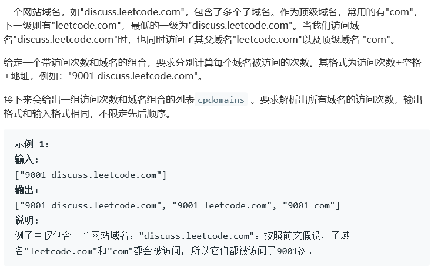
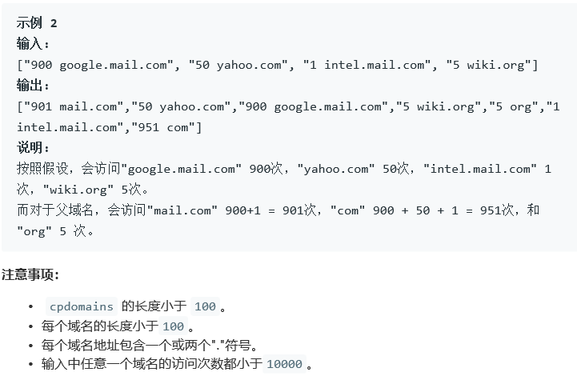
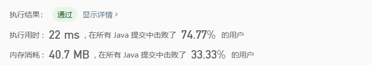

## 811. 子域名访问计数

## Description





## Tag

- 字符串；
- 哈希表；

## Solution

> 哈希表记录数量；

## Code

```java
class Solution {
    public List<String> subdomainVisits(String[] cpdomains) {
        Map<String, Integer> map = new HashMap<>();
        List<String> result = new ArrayList<>();
        for(int i = 0; i < cpdomains.length; i++) {
            String s[] = cpdomains[i].split(" ");
            int cnt = Integer.parseInt(s[0]);
            String str = s[1];
            map.put(str, map.getOrDefault(str, 0) + cnt);
            int index;
            while((index = str.indexOf('.', 0)) != -1) {
                str = str.substring(index + 1);
                map.put(str, map.getOrDefault(str, 0) + cnt);
            }
        }
        for(Map.Entry<String, Integer> entry : map.entrySet()) {
            result.add(entry.getValue() + " " + entry.getKey());
        }
        return result;
    }
}
```

## Record



