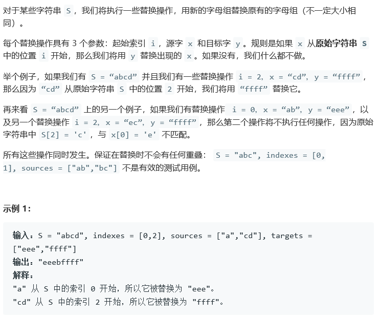
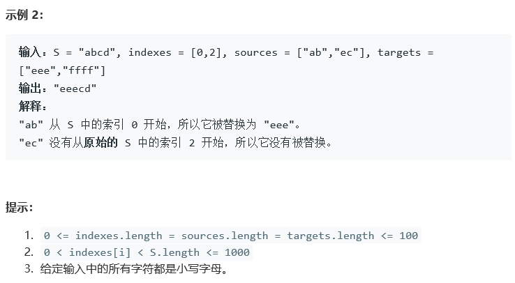
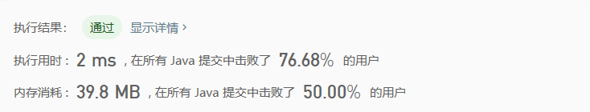

## 833. 字符串中的查找与替换

## Description





## Tag

- tag；

## Solution

> 字符串；

## Code

```java
class Solution {
    class Pos implements Comparable{
        public int index;
        public String source;
        public String target;

        public Pos(int index, String source, String target) {
            this.index = index;
            this.source = source;
            this.target = target;
        }


        @Override
        public int compareTo(Object o) {
            Pos pos = (Pos) o;
            return this.index - pos.index;
        }
    }

    public String findReplaceString(String S, int[] indexes, String[] sources, String[] targets) {
        int n = indexes.length;
        Pos pos[] = new Pos[n];
        for(int i = 0; i < n; i++) {
            pos[i] = new Pos(indexes[i], sources[i], targets[i]);
        }
        Arrays.sort(pos);
        StringBuffer sb = new StringBuffer();
        sb.append(S.substring(0, pos[0].index));
        for(int i = 0; i < pos.length; i++) {
            if(S.startsWith(pos[i].source, pos[i].index)) {
                sb.append(pos[i].target);
                if(i == pos.length - 1)
                    sb.append(S.substring(pos[i].index + pos[i].source.length()));
                else
                    sb.append(S.substring(pos[i].index + pos[i].source.length(), pos[i+1].index));
            } else {
                if(i == pos.length - 1)
                    sb.append(S.substring(pos[i].index));
                else
                    sb.append(S.substring(pos[i].index, pos[i+1].index));
            }
        }
        return sb.toString();
    }
}
```

## Record



