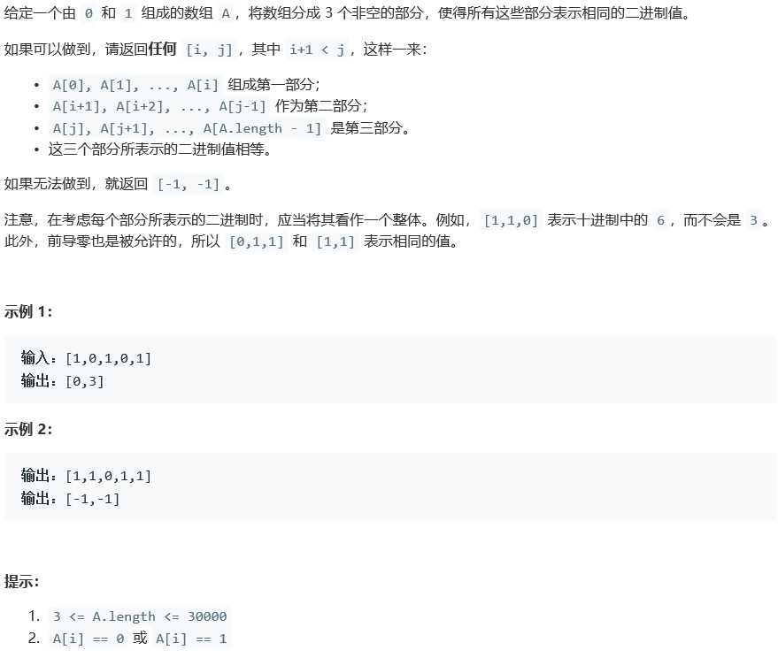

## 927. 三等分

## Description



## Tag

- 二分查找；

## Solution

> 由于三部分的二进制数相同，因此三部分的1的个数必然相同；
>
> 由于三部分的二进制数相同，因此三部分的后缀0的个数必然相同，因此只需要知道第三部分的后缀0，就可以知道前两部分的后缀0的个数；
>
> 由于三部分的二进制数相同，因此三部分从尾部开始比较必然相同，由于三部分1的个数相同，最后剩下的未比较的部分必然是0；

> 计算sum数组；
>
> 计算第三部分的后缀0的个数；
>
> 验证是否不存在1，若不存在1，则返回[0, A.length - 1]；
>
> 二分搜索sum为1/3*total和2/3*total的最左端的下标，即求得第一和第二部分的最后一个1的下标，再加上后缀0的个数即求得结果；
>
> 逆序比较三部分的位，验证结果；

## Code

```java
class Solution {
    public int[] threeEqualParts(int[] A) {
        int[] sum = new int[A.length];
        sum[0] = A[0];
        for(int i = 1; i < A.length; i++)
            sum[i] = sum[i-1] + A[i];
        if(sum[A.length - 1] == 0)
            return new int[]{0, A.length - 1};
        int tot = sum[A.length - 1];
        if(tot % 3 != 0)
            return new int[]{-1, -1};
        int lastZeroCnt = 0;
        while(A[A.length - 1 - lastZeroCnt] == 0)
            lastZeroCnt++;
        int pos1 = lowerBound(sum, 0, sum.length, tot / 3) + lastZeroCnt;
        int pos2 = lowerBound(sum, 0, sum.length, tot * 2 / 3) + lastZeroCnt + 1;
        int end1 = pos1, end2 = pos2 - 1, end3 = A.length - 1;
        while(end1 >= 0 && end2 > pos1 && end3 >= pos2) {
            if(A[end1] == A[end2] && A[end2] == A[end3]){
                end1--;
                end2--;
                end3--;
            } else {
                return new int[]{-1, -1};
            }
        }
        return new int[]{pos1, pos2};
    }

    private int lowerBound(int[] arr, int begin, int end, int tar) {
        while(begin < end) {
            int mid = begin + (end - begin) / 2;
            if(arr[mid] < tar)
                begin = mid + 1;
            else
                end = mid;
        }
        return begin;
    }
}
```

## Record


