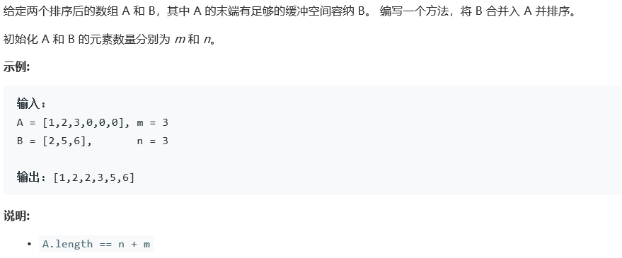
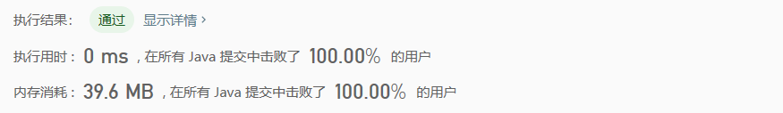

# 面试题 10.01. 合并排序的数组

## Description



## Tag

- 双指针；

## Solution

> 逆序双指针合并，不需要开辟额外的空间

## Code

```java
class Solution {
    public void merge(int[] A, int m, int[] B, int n) {
        int totIndex = m + n - 1;
        int indexA = m - 1;
        int indexB = n - 1;
        for(int i = totIndex; i >= 0; i--) {
            if(indexA >= 0 && (indexB < 0 || A[indexA] >= B[indexB])) {
                A[totIndex--] = A[indexA--];
            } else {
                A[totIndex--] = B[indexB--];
            }
        }
    }
}
```

## Record



