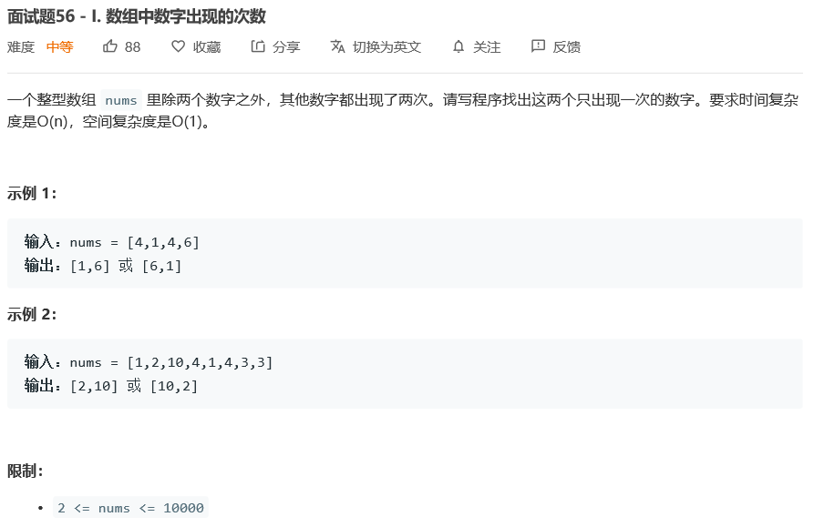
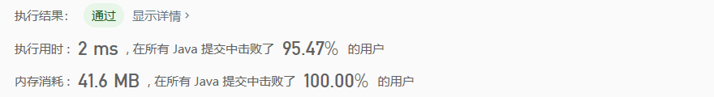

# 面试题56 - I. 数组中数字出现的次数

## Description



## Tag

- 位运算

## Solution

> 假设这两个只出现一次的数字为a和b。

> 由 A xor A = 0 可得，A xor A xor B xor B xor C = C，则将nums数组的所有元素xor后可得a xor b；

> A xor B，是将A和B中不同的位置为1，也就是说，若A xor B的值的第i位为1，则说明A和B的第i位不相同，于是可以将A和B通过第i位区分开来。再利用第i位，将nums数组分为两个组，再次计算xor就可以得出a和b。

## Code

```java
class Solution {
    public int[] singleNumbers(int[] nums) {
        int xor = 0;
        for(int i = 0; i < nums.length; i++) 
            xor ^= nums[i];
        int index = 0;
        while(true){
            if((xor & (1<<index)) != 0)
                break;
            index++;
        }
        int xor1 = 0, xor2 = 0;
        for(int i = 0; i < nums.length; i++){
            if((nums[i] & (1<<index)) != 0){
                xor1 ^= nums[i];
            } else {
                xor2 ^= nums[i];
            }
        }
        return new int[]{xor1, xor2};
    }
}
```

## Record



